# Compte-Rendu Exam : Application de Chat Flutter avec BLoC

**Réalisé par : Oussama EL-AMRANI**  
**Filière : GLSID 2**

## 🏗️ Architecture BLoC Utilisée

### États (States)

L'application utilise plusieurs états immutables grâce à **Equatable** :

#### `ConversationState` (État parent abstrait)
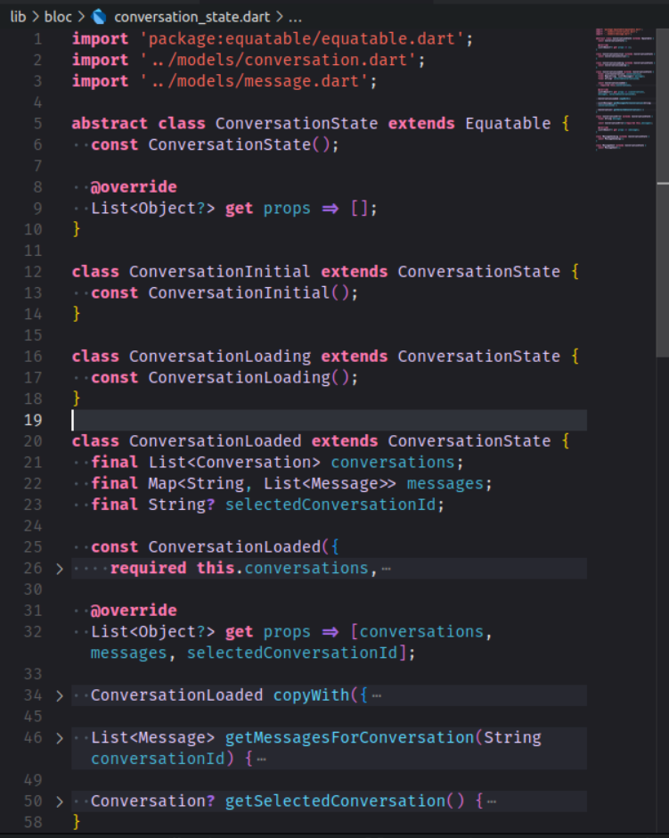
- `ConversationInitial` : État initial de l'application
- `ConversationLoading` : État de chargement des données
- `ConversationLoaded` : État avec les données chargées
  - `conversations` : Liste des conversations
  - `messages` : Map des messages par conversation
  - `selectedConversationId` : ID de la conversation sélectionnée
- `ConversationError` : État d'erreur avec message
- `MessageSending` : État d'envoi de message
- `MessageSent` : État de message envoyé

### Utilisation d'Equatable pour les États Immutables

Tous les états de l'application héritent d'Equatable pour garantir l'immutabilité et optimiser les performances :

```dart
// lib/bloc/conversation_state.dart
abstract class ConversationState extends Equatable {
  const ConversationState();
  
  @override
  List<Object?> get props => [];
}
```

Cette approche permet :
- La comparaison efficace des états (==)
- L'optimisation des rebuilds dans Flutter
- La prévention des mutations accidentelles d'état


### Événements (Events)

L'application gère plusieurs événements :

#### `ConversationEvent` (Événement parent abstrait)
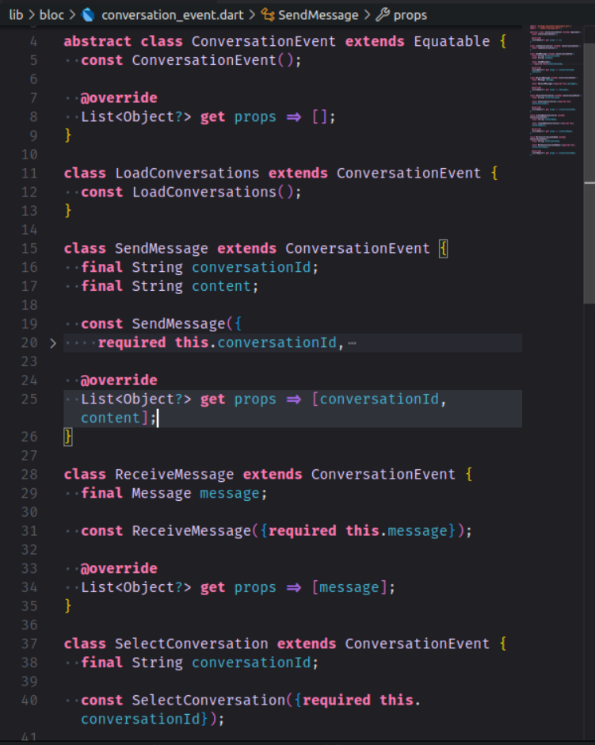
- `LoadConversations` : Charger toutes les conversations
- `SendMessage` : Envoyer un nouveau message
  - `conversationId` : ID de la conversation
  - `content` : Contenu du message
- `ReceiveMessage` : Recevoir un message
  - `message` : Objet Message reçu
- `SelectConversation` : Sélectionner une conversation
  - `conversationId` : ID de la conversation à sélectionner
- `CreateNewConversation` : Créer une nouvelle conversation
  - `contactName` : Nom du nouveau contact
- `MarkConversationAsRead` : Marquer une conversation comme lue
  - `conversationId` : ID de la conversation

### BLoC Principal

Le `ConversationBloc` gère toute la logique métier :
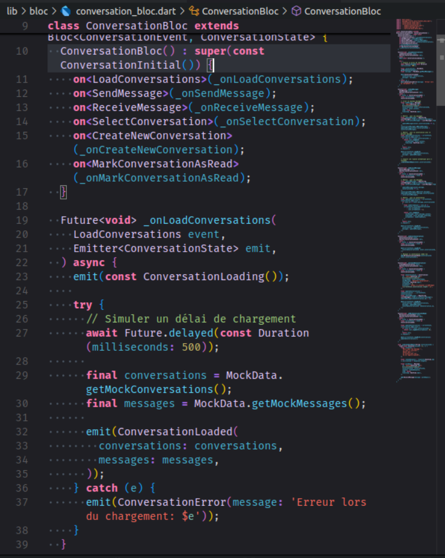
- Traitement des événements
- Émission des nouveaux états
- Simulation des réponses automatiques
- Gestion des messages non lus


##  Navigation Entre les Écrans

### Structure de Navigation

```
ConversationsListScreen (Écran principal)
    ↓ (Tap sur une conversation)
ChatDetailScreen (Écran de conversation)
    ↓ (Bouton retour)
ConversationsListScreen
```

### Mécanisme de Navigation

1. **Navigation vers le détail** :
   ```dart
   // lib/screens/conversations_list_screen.dart
   Navigator.push(
     context,
     MaterialPageRoute(
       builder: (context) => ChatDetailScreen(
         conversationId: conversation.id,
       ),
     ),
   );
   ```

2. **Retour à la liste** :
   - Bouton retour automatique dans l'AppBar
   - Gestion automatique par Flutter

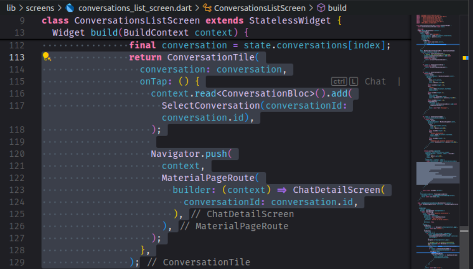

## Simulation des Données

### Données Simulées avec MockData

L'application utilise une classe `MockData` pour simuler les données de l'API :

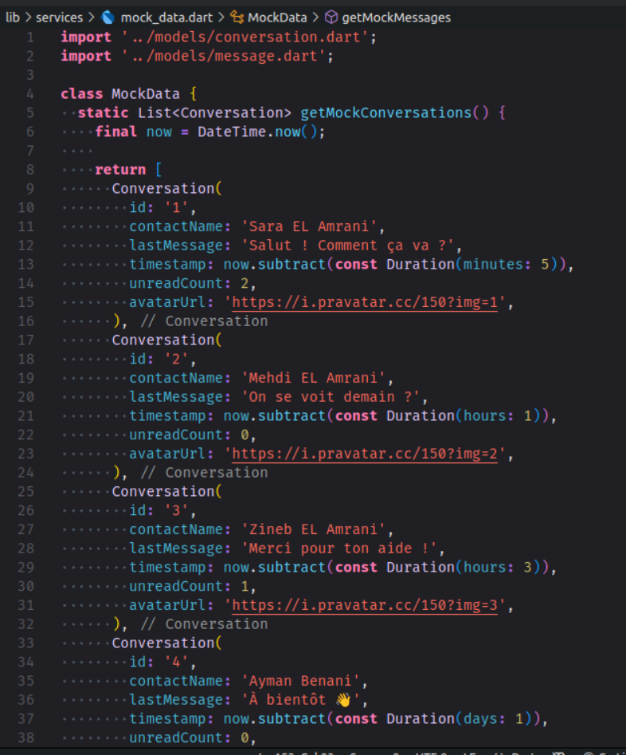


Cette approche permet :
- De développer l'UI sans dépendre d'une API réelle
- De tester différents scénarios (messages non lus, timestamps variés)
- D'avoir des données cohérentes pour les tests

## Fonctionnalités Implémentées

### 📱 Écran Liste des Conversations
- **Affichage complet** : Avatar, nom du contact, dernier message
  ```dart
  // lib/widgets/conversation_tile.dart
  ListTile(
    leading: CircleAvatar(
      backgroundImage: NetworkImage(conversation.avatarUrl),
      radius: 24,
    ),
    title: Text(
      conversation.contactName,
      style: const TextStyle(fontWeight: FontWeight.bold),
    ),
    subtitle: Text(
      conversation.lastMessage,
      maxLines: 1,
      overflow: TextOverflow.ellipsis,
    ),
    trailing: Column(
      mainAxisAlignment: MainAxisAlignment.center,
      crossAxisAlignment: CrossAxisAlignment.end,
      children: [
        Text(
          _formatTimestamp(conversation.timestamp),
          style: TextStyle(
            fontSize: 12,
            color: Colors.grey[600],
          ),
        ),
        const SizedBox(height: 5),
        if (conversation.unreadCount > 0)
          Container(
            padding: const EdgeInsets.all(6),
            decoration: const BoxDecoration(
              color: Colors.red,
              shape: BoxShape.circle,
            ),
            child: Text(
              '${conversation.unreadCount}',
              style: const TextStyle(
                color: Colors.white,
                fontSize: 12,
              ),
            ),
          ),
      ],
    ),
  )
  ```

-  **Badge rouge** pour les messages non lus avec compteur
  ```dart
  // lib/widgets/conversation_tile.dart
  if (conversation.unreadCount > 0)
    Container(
      padding: const EdgeInsets.all(6),
      decoration: const BoxDecoration(
        color: Colors.red,
        shape: BoxShape.circle,
      ),
      child: Text(
        '${conversation.unreadCount}',
        style: const TextStyle(
          color: Colors.white,
          fontSize: 12,
        ),
      ),
    )
  ```

-  **Navigation fluide** vers l'écran de conversation détaillée
-  **Création de nouvelles conversations** via dialogue modal
  ```dart
  // lib/screens/conversations_list_screen.dart
  void _showNewConversationDialog(BuildContext context) {
    final TextEditingController controller = TextEditingController();
    
    showDialog(
      context: context,
      builder: (BuildContext dialogContext) {
        return AlertDialog(
          title: const Text('Nouvelle conversation'),
          content: TextField(
            controller: controller,
            decoration: const InputDecoration(
              labelText: 'Nom du contact',
              hintText: 'Entrez le nom du contact',
            ),
            autofocus: true,
          ),
          actions: [
            TextButton(
              onPressed: () => Navigator.of(dialogContext).pop(),
              child: const Text('Annuler'),
            ),
            TextButton(
              onPressed: () {
                if (controller.text.trim().isNotEmpty) {
                  context.read<ConversationBloc>().add(
                    CreateNewConversation(contactName: controller.text.trim()),
                  );
                  Navigator.of(dialogContext).pop();
                  
                  // Naviguer vers la nouvelle conversation
                  Future.delayed(const Duration(milliseconds: 100), () {
                    final state = context.read<ConversationBloc>().state;
                    if (state is ConversationLoaded && 
                        state.selectedConversationId != null) {
                      Navigator.push(
                        context,
                        MaterialPageRoute(
                          builder: (context) => ChatDetailScreen(
                            conversationId: state.selectedConversationId!,
                          ),
                        ),
                      );
                    }
                  });
                }
              },
              child: const Text('Créer'),
            ),
          ],
        );
      },
    );
  }
  ```

-  **Formatage intelligent des timestamps** :
  ```dart
  // lib/utils/date_formatter.dart
  String _formatTimestamp(DateTime timestamp) {
    final now = DateTime.now();
    final today = DateTime(now.year, now.month, now.day);
    final yesterday = today.subtract(const Duration(days: 1));
    final dateToCheck = DateTime(timestamp.year, timestamp.month, timestamp.day);
    
    if (dateToCheck == today) {
      // Aujourd'hui: afficher l'heure (ex: 14:30)
      return DateFormat.Hm().format(timestamp);
    } else if (dateToCheck == yesterday) {
      // Hier
      return 'Hier';
    } else if (today.difference(dateToCheck).inDays < 7) {
      // Cette semaine: afficher le jour (ex: Lundi)
      return DateFormat.EEEE().format(timestamp);
    } else {
      // Plus ancien: afficher la date (ex: 15/01/24)
      return DateFormat.yMd().format(timestamp);
    }
  }
  ```

-  **Tri automatique** par timestamp (plus récent en premier)
  ```dart
  // lib/screens/conversations_list_screen.dart
  final sortedConversations = List<Conversation>.from(state.conversations)
    ..sort((a, b) => b.timestamp.compareTo(a.timestamp));
  ```

-  **Gestion des états de chargement** avec indicateur
  ```dart
  // lib/screens/conversations_list_screen.dart
  @override
  Widget build(BuildContext context) {
    return Scaffold(
      appBar: AppBar(
        title: const Text('Conversations'),
        actions: [
          IconButton(
            icon: const Icon(Icons.add),
            onPressed: () => _showNewConversationDialog(context),
          ),
        ],
      ),
      body: BlocBuilder<ConversationBloc, ConversationState>(
        builder: (context, state) {
          if (state is ConversationInitial) {
            // Déclencher le chargement des conversations
            context.read<ConversationBloc>().add(LoadConversations());
            return const Center(child: CircularProgressIndicator());
          } else if (state is ConversationLoading) {
            return const Center(child: CircularProgressIndicator());
          } else if (state is ConversationLoaded) {
            // Afficher la liste des conversations
            return _buildConversationsList(context, state);
          } else if (state is ConversationError) {
            return Center(child: Text('Erreur: ${state.message}'));
          } else {
            return const Center(child: Text('État inconnu'));
          }
        },
      ),
    );
  }
  ```

###  Écran de Conversation Détaillée
-  **Interface de chat moderne** avec bulles de messages
  ```dart
  // lib/screens/chat_detail_screen.dart
  @override
  Widget build(BuildContext context) {
    return Scaffold(
      appBar: AppBar(
        title: BlocBuilder<ConversationBloc, ConversationState>(
          builder: (context, state) {
            if (state is ConversationLoaded) {
              final conversation = state.conversations.firstWhere(
                (c) => c.id == widget.conversationId,
                orElse: () => Conversation(
                  id: '',
                  contactName: 'Contact',
                  lastMessage: '',
                  timestamp: DateTime.now(),
                  unreadCount: 0,
                  avatarUrl: '',
                ),
              );
              return Text(conversation.contactName);
            }
            return const Text('Chat');
          },
        ),
        actions: [
          IconButton(icon: const Icon(Icons.call), onPressed: () {}),
          IconButton(icon: const Icon(Icons.videocam), onPressed: () {}),
          IconButton(icon: const Icon(Icons.more_vert), onPressed: () {}),
        ],
      ),
      body: Column(
        children: [
          // Liste des messages
          Expanded(
            child: BlocBuilder<ConversationBloc, ConversationState>(
              builder: (context, state) {
                if (state is ConversationLoaded) {
                  final messages = state.messages[widget.conversationId] ?? [];
                  
                  if (messages.isEmpty) {
                    return const Center(
                      child: Text('Aucun message. Commencez la conversation !'),
                    );
                  }
                  
                  return ListView.builder(
                    controller: _scrollController,
                    padding: const EdgeInsets.all(10),
                    itemCount: messages.length,
                    itemBuilder: (context, index) {
                      final message = messages[index];
                      return MessageBubble(message: message);
                    },
                  );
                }
                return const Center(child: CircularProgressIndicator());
              },
            ),
          ),
          
          // Champ de saisie
          Padding(
            padding: const EdgeInsets.all(8.0),
            child: Row(
              children: [
                Expanded(
                  child: TextField(
                    controller: _messageController,
                    decoration: const InputDecoration(
                      hintText: 'Votre message...',
                      border: OutlineInputBorder(
                        borderRadius: BorderRadius.all(Radius.circular(25)),
                      ),
                      contentPadding: EdgeInsets.symmetric(
                        horizontal: 16,
                        vertical: 8,
                      ),
                    ),
                    minLines: 1,
                    maxLines: 5,
                  ),
                ),
                const SizedBox(width: 8),
                FloatingActionButton(
                  onPressed: _sendMessage,
                  child: const Icon(Icons.send),
                  mini: true,
                ),
              ],
            ),
          ),
        ],
      ),
    );
  }
  ```

-  **Différenciation visuelle** des messages
  ```dart
  // lib/widgets/message_bubble.dart
  class MessageBubble extends StatelessWidget {
    final Message message;
    
    const MessageBubble({
      Key? key,
      required this.message,
    }) : super(key: key);
    
    @override
    Widget build(BuildContext context) {
      return Align(
        alignment: message.isMe ? Alignment.centerRight : Alignment.centerLeft,
        child: Container(
          margin: const EdgeInsets.symmetric(vertical: 5),
          padding: const EdgeInsets.symmetric(horizontal: 15, vertical: 10),
          decoration: BoxDecoration(
            color: message.isMe ? Colors.blue : Colors.grey[300],
            borderRadius: BorderRadius.circular(18),
          ),
          child: Column(
            crossAxisAlignment: CrossAxisAlignment.end,
            children: [
              Text(
                message.content,
                style: TextStyle(
                  color: message.isMe ? Colors.white : Colors.black,
                ),
              ),
              const SizedBox(height: 5),
              Text(
                DateFormat.Hm().format(message.timestamp),
                style: TextStyle(
                  fontSize: 10,
                  color: message.isMe ? Colors.white70 : Colors.black54,
                ),
              ),
            ],
          ),
        ),
      );
    }
  }
  ```

-  **Champ de saisie** avec bouton d'envoi
  ```dart
  // lib/screens/chat_detail_screen.dart
  Padding(
    padding: const EdgeInsets.all(8.0),
    child: Row(
      children: [
        Expanded(
          child: TextField(
            controller: _messageController,
            decoration: const InputDecoration(
              hintText: 'Votre message...',
              border: OutlineInputBorder(
                borderRadius: BorderRadius.all(Radius.circular(25)),
              ),
              contentPadding: EdgeInsets.symmetric(
                horizontal: 16,
                vertical: 8,
              ),
            ),
            minLines: 1,
            maxLines: 5,
          ),
        ),
        const SizedBox(width: 8),
        FloatingActionButton(
          onPressed: _sendMessage,
          child: const Icon(Icons.send),
          mini: true,
        ),
      ],
    ),
  )
  ```

-  **Scroll automatique** vers le bas lors de nouveaux messages
  ```dart
  // lib/screens/chat_detail_screen.dart
  @override
  void initState() {
    super.initState();
    _scrollController = ScrollController();
    
    // Marquer la conversation comme lue
    WidgetsBinding.instance.addPostFrameCallback((_) {
      context.read<ConversationBloc>().add(
        MarkConversationAsRead(conversationId: widget.conversationId),
      );
    });
  }
  
  @override
  void didUpdateWidget(ChatDetailScreen oldWidget) {
    super.didUpdateWidget(oldWidget);
    
    // Scroll vers le bas quand de nouveaux messages arrivent
    WidgetsBinding.instance.addPostFrameCallback((_) {
      if (_scrollController.hasClients) {
        _scrollController.animateTo(
          _scrollController.position.maxScrollExtent,
          duration: const Duration(milliseconds: 300),
          curve: Curves.easeOut,
        );
      }
    });
  }
  ```

-  **Réponses automatiques simulées** après 2 secondes
  ```dart
  // lib/bloc/conversation_bloc.dart
  void _simulateAutoReply(String conversationId) {
    Timer(const Duration(seconds: 2), () {
      final responses = [
        'Merci pour ton message !',
        'Je vais y réfléchir',
        'Bonne idée !',
        'D\'accord avec toi',
        'On en reparle bientôt',
      ];
      
      final randomResponse = responses[DateTime.now().millisecond % responses.length];
      
      final autoReply = Message(
        id: 'auto_${DateTime.now().millisecondsSinceEpoch}',
        conversationId: conversationId,
        content: randomResponse,
        isMe: false,
        timestamp: DateTime.now(),
      );
      
      add(ReceiveMessage(message: autoReply));
    });
  }
  ```

### 🔧 Fonctionnalités Techniques
-  **Gestion d'état BLoC** complète
  ```dart
  // lib/bloc/conversation_bloc.dart
  @override
  Stream<ConversationState> mapEventToState(
    ConversationEvent event,
  ) async* {
    if (event is LoadConversations) {
      yield* _mapLoadConversationsToState();
    } else if (event is SendMessage) {
      yield* _mapSendMessageToState(event);
    } else if (event is ReceiveMessage) {
      yield* _mapReceiveMessageToState(event);
    } else if (event is SelectConversation) {
      yield* _mapSelectConversationToState(event);
    } else if (event is CreateNewConversation) {
      yield* _mapCreateNewConversationToState(event);
    } else if (event is MarkConversationAsRead) {
      yield* _mapMarkConversationAsReadToState(event);
    }
  }
  ```

-  **États immutables** avec Equatable
-  **Données simulées** réalistes
-  **Tests unitaires** et d'intégration
-  **Gestion d'erreurs** robuste
-  **Performance optimisée** avec ListView.builder
  ```dart
  // lib/screens/conversations_list_screen.dart
  ListView.builder(
    itemCount: sortedConversations.length,
    itemBuilder: (context, index) {
      final conversation = sortedConversations[index];
      return ConversationTile(
        conversation: conversation,
        onTap: () {
          // Navigation...
        },
      );
    },
  )
  ```

## Modèles de Données

### Conversation
```dart
// lib/models/conversation.dart
class Conversation {
  final String id;
  final String contactName;
  final String lastMessage;
  final DateTime timestamp;
  final int unreadCount;
  final String avatarUrl;
}
```

### Message
```dart
// lib/models/message.dart
class Message {
  final String id;
  final String conversationId;
  final String content;
  final bool isMe; // pour aligner les bulles à droite/gauche
  final DateTime timestamp;
}
```

## Structure du Projet
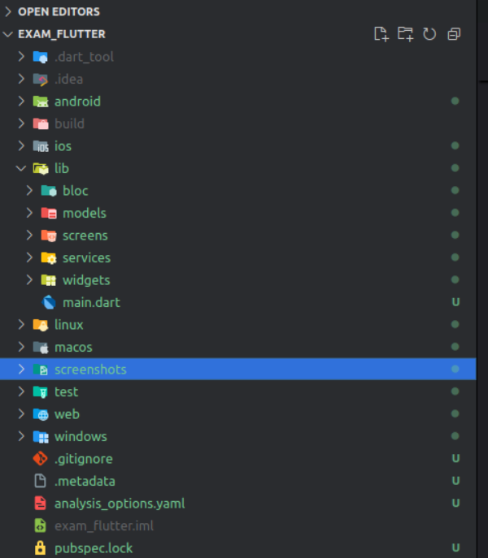


## Dépendances

- `flutter_bloc`: Gestion d'état BLoC
- `equatable`: États immutables
- `intl`: Formatage des dates
## Le Resultat final
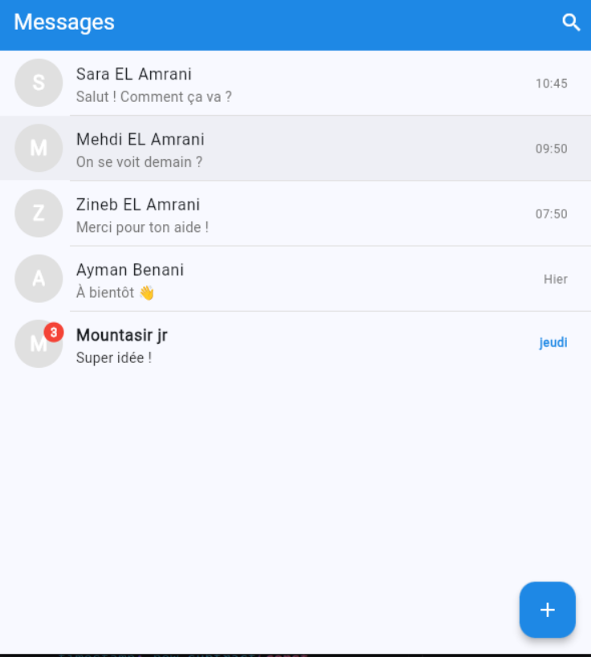
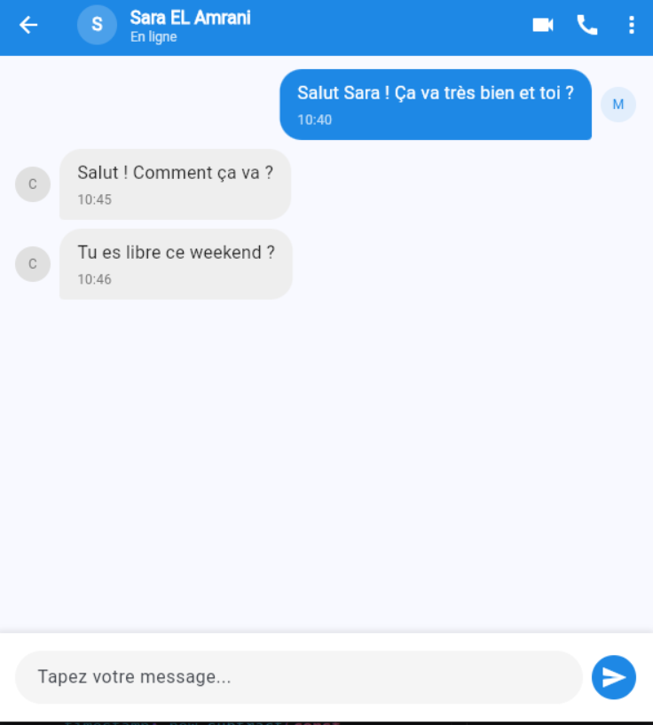
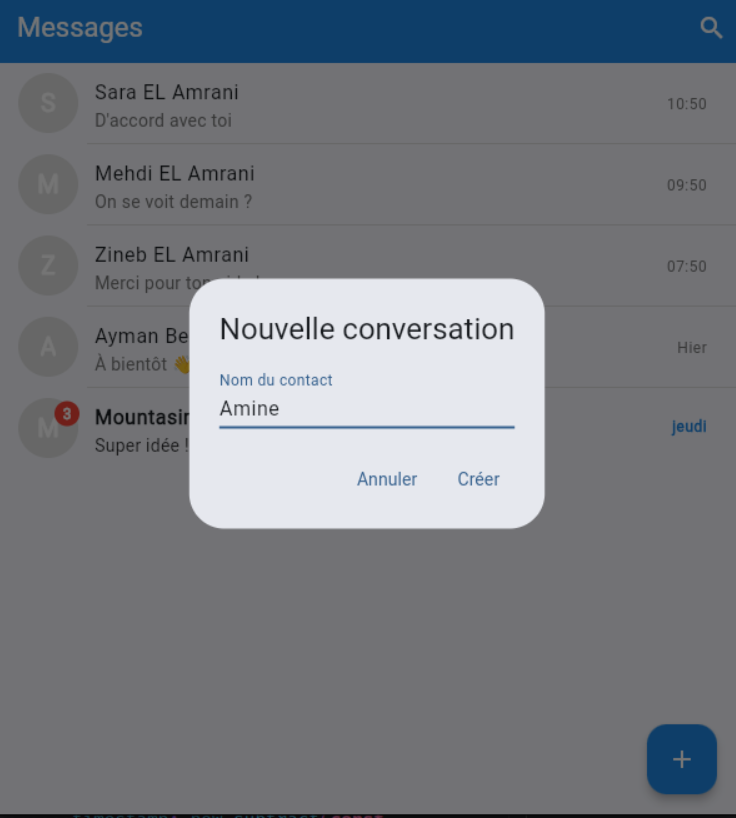
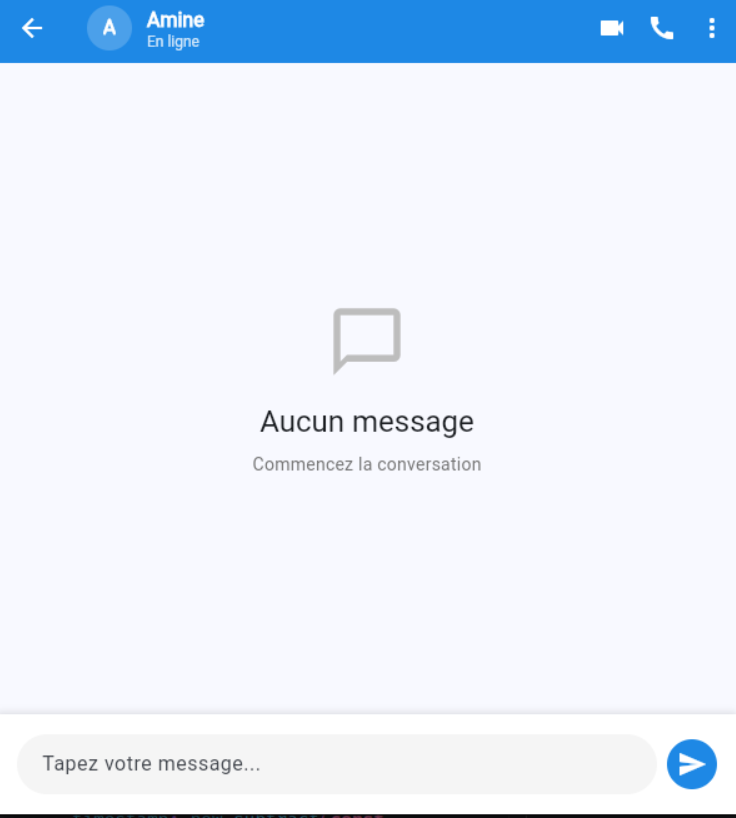
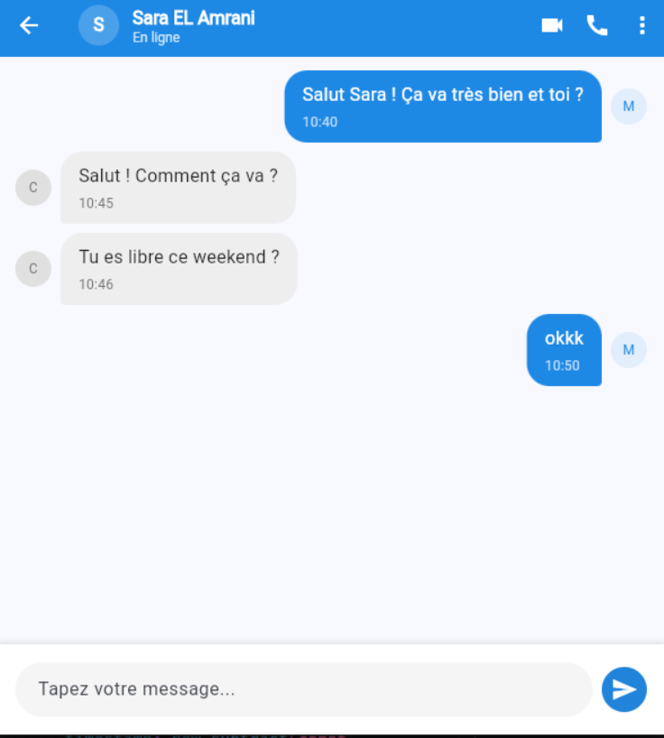
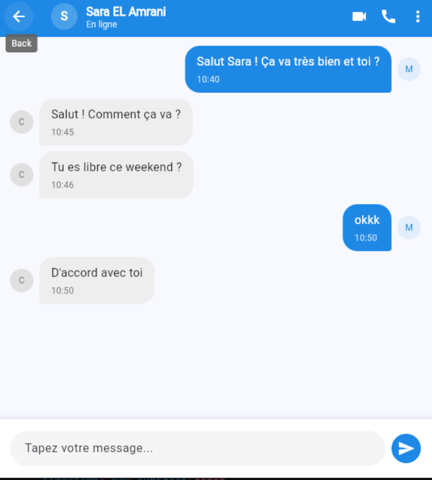


